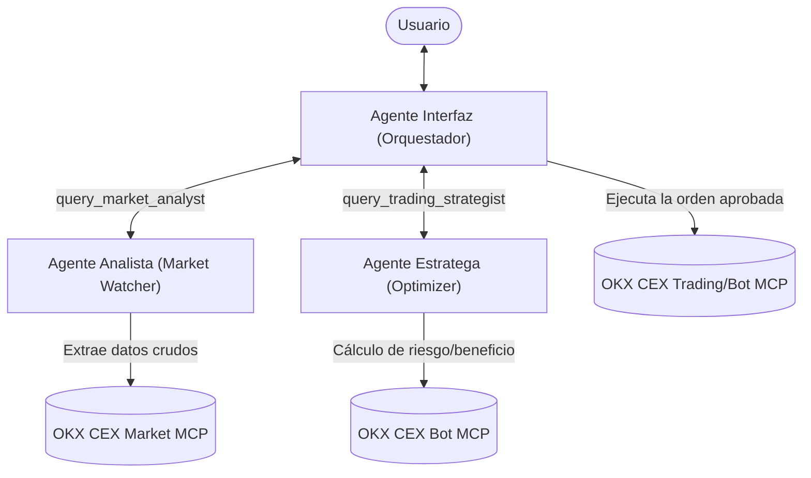

# Neptune AI: Nexo de Trading Multi-Agente OKX

Este proyecto implementa el sistema multi-agente de trading para **OKX** utilizando el **Google Antigravity SDK** y el servidor MCP **OKX Agent Trade Kit**. El sistema está optimizado para ejecutarse en **Google Cloud (Vertex AI)** y está diseñado bajo una estética visual de "Bioluminiscencia Abisal" en la terminal.

## Arquitectura del Sistema

El sistema utiliza tres agentes especializados coordinados jerárquicamente para proporcionar una experiencia de trading conversacional y autónoma estructurada:



1. **Agente Interfaz (Orquestador Principal):**
   - Recibe la instrucción del usuario (ej. *"Abrir una estrategia rentable en BTC"*).
   - Coordina a los agentes Analista y Estratega mediante herramientas personalizadas.
   - Presenta la propuesta al usuario y solicita su aprobación explícita antes de ejecutar cualquier transacción.
   - Ejecuta bots en OKX tras recibir confirmación.
   
2. **Agente Analista (Market Watcher):**
   - Opera en modo **Solo Lectura** (`--read-only`) con el módulo `market`.
   - Extrae el RSI, tickers, order books y volumen.
   - Genera informes estructurados en JSON.

3. **Agente Estratega (Optimizer):**
   - Opera en modo **Solo Lectura** (`--read-only`) con los módulos `market` y `bot`.
   - Analiza los datos del Analista y determina la configuración óptima para bots de Grid o DCA.
   - Configurado con un perfil de **Riesgo Medio** buscando **ganancias rápidas y seguras** (cuadrículas estrechas en activos de alta liquidez, amortiguadores de retroceso conservadores en DCA).

---

## Configuración del Entorno

### 1. Requisitos Previos
- Node.js (requerido para ejecutar el servidor MCP de OKX mediante `npx`).
- Python 3.10+ con el entorno virtual activado.
- Google Cloud SDK autenticado (si ejecutas en Vertex AI).

### 2. Archivo de Configuración (`.env`)
Crea tu archivo `.env` a partir de la plantilla `.env.example`:

```bash
cp .env.example .env
```

Edita `.env` con tus credenciales:

```env
# Google Cloud / Vertex AI Runtime Configuration
USE_VERTEX_AI=true
GCP_PROJECT=tu-proyecto-gcp
GCP_LOCATION=us-central1

# Autenticación OKX (Requerido)
OKX_API_KEY=tu-okx-api-key
OKX_SECRET_KEY=tu-okx-api-secret
OKX_PASSPHRASE=tu-okx-passphrase

# Entorno de Trading (demo o live)
OKX_MODE=demo
```

> [!WARNING]
> **Modo Demo por Defecto:** Por seguridad, `OKX_MODE` está configurado como `demo` (simulación de fondos virtuales). Cambia a `live` únicamente cuando estés listo para operar con capital real.

---

## Cómo Ejecutar el Sistema

1. **Activa el entorno virtual:**
   ```bash
   source venv/bin/activate
   ```

2. **Inicia el Nexo Multi-Agente:**
   ```bash
   python main.py
   ```

3. **Ejemplo de Flujo de Trabajo en la Terminal:**
   ```
   Usuario > Abrir una estrategia rentable en BTC
   [Pensando...] El Agente Interfaz está procesando tu solicitud...
   
   [Interfaz -> Analista] Solicitando datos técnicos y de mercado para BTC...
   [Analista -> Interfaz] Datos de mercado obtenidos para BTC.
   
   [Interfaz -> Estratega] Solicitando cálculo de estrategia óptima de riesgo medio...
   [Estratega -> Interfaz] Recomendación de parámetros y estrategia recibida.
   
   Interfaz > El Analista observa que BTC se encuentra en rango con un RSI de 52, y un volumen estable de 24h. El Estratega propone implementar un Grid Bot de riesgo medio en BTC-USDT con el rango 68,000 - 72,000, 20 rejillas aritméticas y una inversión de 100 USDT.
   
   ¿Deseas que ejecute esta estrategia en tu cuenta de simulación?
   
   Usuario > Sí, ejecútala.
   ...
   ```

---

## Seguridad y Permisos
- El **Analista** y el **Estratega** están bloqueados con la bandera `--read-only` a nivel de MCP para evitar cualquier llamada de escritura o ejecución inadvertida.
- El **Interfaz** utiliza la política `confirm_run_command()` del Antigravity SDK por defecto, lo que deniega accesos directos al sistema de comandos shell del ordenador anfitrión, mientras permite a las APIs de trading de OKX interactuar bajo el control del usuario.
- Todos los secretos (API keys y credenciales) se cargan localmente y **nunca** se exponen al modelo de lenguaje. Las firmas y la ejecución se procesan de manera local.
